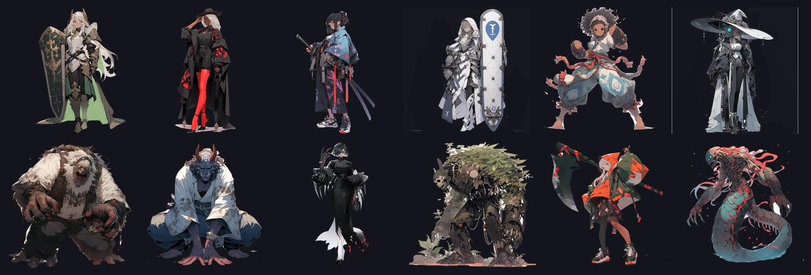
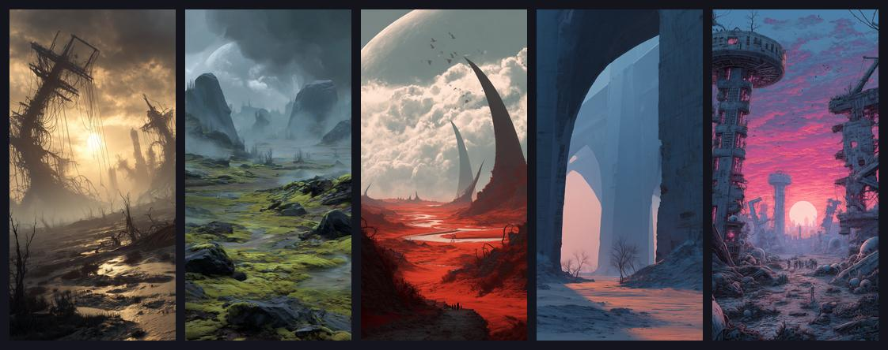

# GridGame2026

A tactical grid RPG in Unity 6 where position is the only weapon: slide heroes across the board, trap foes in pincers, and push enemy turns back along a Grandia-style timeline. Every scene is built from code.

    



There is no public download. Build the Windows player yourself with `Run.bat` or open the project in Unity (see Quick start).

> We ate through the world like acid. Seeping into the Undearth, trickling ever downward, consuming all we encountered; never sated, never still. Until we met resistance. Dwellers in the dark. A people who had never known war or light. We were interlopers. Invaders from above, a light-bearing race corrupting everything in our wake.

You command a band of light-bearing invaders descending into the Undearth, a sunless world of dwellers who have never known war. Every encounter is a puzzle of position: drag your heroes across the grid, shove enemies and allies aside, and trap your foes between two attackers to deal the only damage that matters.

## Why

- Position is the only weapon. Movement deals zero damage; the pincer your new position completes does. Every drag asks one question: does this finish the line?
- The slide. Drag a hero onto an occupied tile and the displaced actor, friend or foe, slides into the tile you just left. Use the shove to set up flanks, pull allies out of danger, or feed an enemy into a kill zone.
- A clock you can control. Enemies load left to right along the timeline at the top of the screen. Strike a foe whose icon sits in the rightmost Pushback Zone and its turn is shoved back toward spawn, so well-timed pincers can stall the heaviest hitters.
- Clutch moments. Get hit mid-cast and the spell can Fail, get Pushed back, or, when your luck holds, Clutch: resolve on the spot as the caster falls.
- Code-only Unity. Every scene is the output of a `*Builder.cs` file, with no prefab dragging and no inspector wiring, and pre-push guardrails keep it that way.

## Features

### Slide pincer pushback

- Pincer combat: line up two heroes on the same row or column with an unbroken file of enemies between them and the pincer fires. Chained pairs give cascading volleys that can clear whole ranks in one drag.
- The slide: dragging onto an occupied tile displaces that actor into the tile you vacated.
- The timeline: enemy icons load left to right; reaching the right edge queues that enemy's turn. Striking an enemy inside the Pushback Zone delays it.
- Supporters: allies next to either end of a pincer add bonus damage, so a stacked formation turns a routine attack into a cleave.

### Casts interrupts and clutch moments

Mana is a shared 12-orb bank harvested from pincers. Abilities spend it and travel as their own icon down the timeline. Take a hit mid-cast and roll one of three outcomes: Fail, Pushback or Clutch, where the spell snaps to its trigger and resolves the instant the caster crumples. A dying healer can still let off one last miracle.

### Beyond the battlefield

- Themed campaigns of hand-built stages connected by a stage-select hub
- Vendor scenes for every craft: Alchemist, Blacksmith, Equip, Party and Abilities
- Weapon durability with shatter rebound, dual damage on break and decaying repair caps
- Original lore and world building set in the corrupted depths of the Undearth
- Custom ShaderLab effects for the 2D-on-3D presentation
- Profile and save-state persistence as JSON



## Quick start

1. Install Unity 6000.4.3f1 (revision `39d1a88d4dd1`, pinned in `ProjectSettings/ProjectVersion.txt`) through Unity Hub. Opening the project with a different editor version triggers a re-import and can corrupt the `Library/` package cache.
2. Clone the repo, or let `GridGame.Console.ps1` option 4 (Setup) do it for you.
3. Open the folder in Unity Hub. The first import is slow; later opens are fast.
4. Activate the pre-push hook so the guardrails run automatically (Setup option 4 also does this, idempotently).
5. Press Play. The scene that loads is set by `Assets/Scripts/Data/Config/StartSceneConfig.cs`; console option 6 changes it.
6. To build the standalone Windows player without the editor UI, run console option 5, or run `Run.bat`, which builds `Build\Windows\GridGame.exe` on first run and then launches it.

```powershell
git clone https://github.com/mindattic/GridGame2026.git
cd GridGame2026
git config core.hooksPath .githooks
```

There is no package-restore step beyond Unity's own import; `Packages/` is a standard Unity Package Manager manifest.

## How the game plays

GridGame2026 is a single-player, turn-structured, grid-position tactical RPG. Combat happens on one board, a grid of tiles rendered as 2D sprites on a 3D board through URP. There is no conventional attack button; the combat system is built around where actors end up.

- The player drags a hero from tile to tile, one cardinal step at a time (`ActorMovement.TowardDestinationRoutine()`); there are no diagonals.
- Dragging onto an occupied tile displaces whatever is there into the tile the hero just left (`ActorMovement.CheckLocationChanged()` then `HandleOverlap()`).
- Damage is dealt when a drag completes a pincer: two heroes sharing a row or column with an unbroken line of enemies between them (`PincerAttackManager.Check()`).
- Turn order is driven by a horizontal timeline strip, a Grandia-style gauge where enemy icons load left to right; reaching the right edge queues that enemy's turn (`TimelineBarInstance`, `TurnManager.IsHeroTurn`, `HasQueuedEnemyAfterHero`).
- Striking an enemy whose icon is already in the Pushback Zone shoves it back toward spawn (`TimelineBarInstance.PushbackOnAttack()`).
- Spellcasting shares the 12-orb mana bank and resolves as its own icon on the same timeline; a hit mid-cast can Fail, Push back or Clutch (`ManaPoolManager`, `CastingState`, `CastInterruptResolver`).

Outside combat, a hub and vendor loop connects themed campaigns of battle stages, and vendor scenes handle crafting, gear and party management. Progress persists through a `Profile` to `SaveState` JSON save system. The canonical rules are in [docs/BIBLE.md](docs/BIBLE.md).

## Stack

| Layer | Technology |
| --- | --- |
| Engine | Unity 6000.4.3f1 (Unity 6) |
| Scripting | C# 9, targeting .NET Standard 2.1 |
| Root namespace | `Scripts.*` (the csproj `RootNamespace` is intentionally empty) |
| Rendering | 2D sprites on a 3D board, URP 17.4.0, custom ShaderLab effects |
| Asset loading | Addressables 2.9.1 only, no `Resources.Load` in new code |
| Persistence | `Profile` to `SaveState` JSON; XP stored as `TotalXP` and derived at runtime |
| Testing | Unity Test Framework 1.6.0, Edit Mode and Play Mode (NUnit) |
| Build target | `win-x64`, `StandaloneWindows64` |

## Repository layout

```text
GridGame2026/
  Assets/
    Scripts/                 game code (root namespace Scripts.*), 736 .cs files under Assets/
      Data/                  static data definitions (ItemData, ActorData, SkillData classes)
      Models/                data structures, enums, Singleton<T>
      Managers/              singleton game systems (TurnManager, PincerAttackManager, ...)
      Instances/             runtime MonoBehaviours (ActorInstance, ActorMovement, ...)
      Sequences/             async combat and UI event queue
      Canvas/                in-game HUD (TimelineBar, TimelineIcon, ...)
      Factories/             object creation (the only place Instantiate() is allowed)
      Libraries/             lazy-loaded registries (ItemLibrary, ActorLibrary, ...)
      Services/              pure-logic helpers (EnemyPlanner, PincerDetector, CastInterruptResolver, ...)
      Helpers/               GameHelper, the global accessor (using g = ...)
      Abilities/, Alchemist/, Blacksmith/, Equip/, Party/, Vendor/, Hub/   vendor and hub scenes
      Summon/, StoryCrawl/, Overworld/, Inventory/, Effects/, Serialization/, Utilities/
      ARCHITECTURE.md        per-folder architecture notes
    Editor/
      Builders/              *Builder.cs, the source of truth for every scene
      BuilderDriftChecker.cs guardrail: scene YAML vs builder output
      CliEntryPoints.cs      batchmode entry points (build, guardrails, ...)
      InstantiateBan.cs, ResourcesLoadBan.cs, SerializedFieldBan.cs   guardrails
      DebugWindow.*.cs       in-editor debug window (11 partial-class files)
      *Allowlist.txt         curated guardrail exceptions
    Scenes/                  22 .unity scenes
    Tests/EditMode/, Tests/PlayMode/
  Documentation/             technical docs (builders, scene hierarchies, style guide)
  docs/                      Codex canon: BIBLE, AMENDMENTS, USER_STORIES, data/, rfc/
  Tools/                     codex.ps1, build-readme.ps1, run-tests.ps1, ParseScene.ps1
  GridGame.Console.ps1       operator console
  GridGame.Console.bat       launches the console in a titled PowerShell window
  Run.bat                    build-if-missing, then launch the player
  Backup.ps1, Export.ps1     legacy backup script, source exporter
```

## Assets reference

Top-level folders under `Assets/`: Adaptive Performance, AddressableAssetsData, Animations, Animator, Devices, Documentation, Editor, Fonts, Lights, Maps, Materials, Mesh, MusicTracks, Others, Particles, Plugins, PostProcessing, Prefabs, Resources, Scenes, Scripts, Settings, Shader, Shared, SoundEffects, Sprites, Synergy, Tests, TextMesh Pro, Textures, URP, VisualEffects.

`Assets/Editor/` holds every editor-only tool: the four guardrails and their allowlists, `CliEntryPoints.cs`, the `Builders/` folder (one builder per scene; see [Documentation/Builders/README.md](Documentation/Builders/README.md)), analyzers (`AddressablesAnalyzer`, `AnimatorAnalyzer`, `PrefabAnalyzer`, `ProjectSettingsAnalyzer`, `SceneAnalyzer`, `ScriptableObjectAnalyzer`), `StartSceneAuthority.cs`, `SpriteAssetAuthor.cs`, `VfxPrefabAuthor.cs`, `EightWayAnimatorGenerator.cs`, `AltTesterStripper.cs` (see [Documentation/AltTester-Setup.md](Documentation/AltTester-Setup.md)) and the `DebugWindow.*.cs` window.

`Assets/Scenes/` contains 22 scenes: Abilities, Alchemist, Bestiary, Blacksmith, Credits, Equip, Game, Hub, LoadingScreen, Overworld, Party, PostBattleScreen, ProfileCreate, ProfileSelect, SaveFileSelect, Settings, SplashScreen, StageSelect, StoryCrawl, Summon, TitleScreen and Vendor, plus a `Game/` subfolder. Scenes other than Game and Overworld are reproducible from their matching builder.

## Helper scripts

| Script | What it does |
| --- | --- |
| `GridGame.Console.ps1` | The operator console: an interactive PowerShell menu with six numbered operations, listed below. |
| `GridGame.Console.bat` | Opens a titled, `-NoExit` PowerShell window running the console. |
| `Run.bat` | If `Build\Windows\GridGame.exe` is missing, builds it with a headless Unity batchmode call to `CliEntryPoints.BuildStandaloneWindows`, then launches it. |
| `Backup.ps1` | Legacy and stale: its defaults point at the earlier GridGame2025 project. The console's Create Backup option uses its own inline logic instead. |
| `Export.ps1` | Standalone utility. Scans the repo for `.cs` files (skipping Library, Temp, Logs, obj, .git, .vs, Build, Builds and Packages), records a SHA256 hash, line count and GUID per file, and writes one `ExportedScripts.txt` bundle for handing the codebase to an LLM. |
| `COMMIT.cmd` | Empty, dead file; replaced by console option 2. |
| `Tools/run-tests.ps1` | Headless Unity Test Framework runner for EditMode or PlayMode (see Testing). |

Console menu:

| Number | Operation | Notes |
| --- | --- | --- |
| 1 | Run Application | Launches the Unity editor on this project. |
| 2 | Commit and Sync | `git add -A`, prompts for a message, commits and pushes. Aborts cleanly on an empty message or a failed commit or push. |
| 3 | Create Backup | Copies the repo (excluding Library, Temp, obj and Logs) to a dated folder on a local backup drive, with a letter suffix on same-day collisions. |
| 4 | Setup | Idempotent: clone or pull the repo, set `core.hooksPath` to `.githooks`, and launch Unity for the first import. |
| 5 | Build Player (headless) | Runs `CliEntryPoints.BuildStandaloneWindows` in batchmode, logging to `Logs/cli-<timestamp>.log`. |
| 6 | Set Start Scene | Lists every scene, lets you pick one, and rewrites the `StartScene` constant in `StartSceneConfig.cs`. `StartSceneAuthority` applies it to the play-mode start scene and build settings on the next domain reload. |

Headless invocations from an agent or CI. Exit code 0 means success, 1 means failure.

```powershell
Unity -batchmode -nographics -projectPath . `
  -executeMethod CliEntryPoints.<Method> -quit -logFile -
```

## Code-only workflow

The project is authored to run without opening Unity's editor UI. Every scene is the regenerated output of its `Assets/Editor/Builders/*Builder.cs`; the builder is the source of truth and the `.unity` file is the build artifact.

- New GameObjects go in the scene's builder. `BuilderAutoRebuild` regenerates the scene after the next domain reload.
- New UI extends the existing factory pattern (`ActorFactory`, `HubItemRowFactory`, ...). Do not create new `.prefab` files.
- New assets (sprite, font, audio) get an Addressable address and load through `AssetHelper.LoadAssetAsync<T>(address)`. No inspector drag-and-drop references.
- Avoid new `[SerializeField]`. Initialize from data-layer statics or factory parameters.

Builder to scene auto-rebuild: `BuilderAutoRebuild.cs` is an `[InitializeOnLoad]` watcher. After every domain reload it compares each builder's modified time against `Library/BuilderMTimes.json` and rebuilds the matching scene. Manual escape hatch: Tools, Scenes, Rebuild All, or `CliEntryPoints.BuilderAllScenes` in batchmode.

The reverse direction (scene to builder) is intentionally absent. A scene file is YAML, a builder is C#, and the mapping needs judgment. Hand-edited scenes are caught by `BuilderDriftChecker`.

## Guardrails

The `.githooks/pre-push` hook enforces these (activated by Setup option 4):

| Guardrail | What it blocks | Allowlist |
| --- | --- | --- |
| `SerializedFieldBan` | new `[SerializeField]` fields in `Scripts/` | `Assets/Editor/SerializedFieldAllowlist.txt` |
| `ResourcesLoadBan` | new `Resources.Load*` call sites | `Assets/Editor/ResourcesLoadAllowlist.txt` |
| `InstantiateBan` | `Instantiate(` outside factory classes | `Assets/Editor/InstantiateAllowlist.txt` |
| `BuilderDriftChecker` | scene YAML drifting from its builder's output | `Documentation/Builders/Drift/*.snapshot.txt` |

`CliEntryPoints.CheckAllGuardrails` runs all four in one batchmode session; run it before handing work back. Bypass for hotfixes with `git push --no-verify`.

## Testing

- Framework: Unity Test Framework 1.6.0, NUnit underneath.
- Projects: `Tests.EditMode.csproj` and `Tests.PlayMode.csproj` alongside the game (`Assembly-CSharp.csproj`) and editor (`Assembly-CSharp-Editor.csproj`) projects.
- Edit Mode tests: 13 files in `Assets/Tests/EditMode`.
- Play Mode tests: `BattleLoopScenarioTests`, `PincerScenarioTest`, `SceneBootSmokeTests` and `SnakeBossTests` in `Assets/Tests/PlayMode`.
- In the editor: Window, General, Test Runner.
- Headless, with the editor closed. The runner fails on any failed test case, any `error CS` compile line or a non-zero Unity exit code:

```powershell
powershell -File Tools\run-tests.ps1 -Platform EditMode
powershell -File Tools\run-tests.ps1 -Platform PlayMode
powershell -File Tools\run-tests.ps1 -Platform PlayMode -Filter "Scripts.Tests.PlayMode.SceneBootSmokeTests"
```

Validate the docs and regenerate this page's HTML:

```powershell
powershell -NoProfile -ExecutionPolicy Bypass -File Tools\codex.ps1 doctor
powershell -NoProfile -ExecutionPolicy Bypass -File Tools\build-readme.ps1
```

## Known issues

- Unity version mismatch: `GridGame.Console.ps1` and `Run.bat` hardcode the editor path to 6000.3.2f1, while `ProjectSettings/ProjectVersion.txt` pins 6000.4.3f1. With only 6000.4.3f1 installed, console options 1, 4 and 5 and the auto-build in `Run.bat` report "Unity editor not found".
- `Backup.ps1` is left over from the previous project; the real backup logic is inline in the console (option 3).
- `COMMIT.cmd` is an empty, dead file.
- `Tools/SceneHierarchies.txt` appears to be a stray duplicate of the authoritative `Documentation/Builders/SceneHierarchies.txt`.

## Status

Single-developer project. Every V1 user story is done except US-104, the 60 fps profiling pass on a physical device. The backlog also holds a merged vendor hub, roguelike and new-game-plus modes, a tutorial and relic passives. There is no dialog system and no overworld. See the active frontier in [docs/BIBLE.md](docs/BIBLE.md).

## Documentation

Docs are split between two folders with different roles.

| Folder | Role |
| --- | --- |
| [docs](docs) | The MindAttic Codex canon, the source of truth for what the game is: [BIBLE.md](docs/BIBLE.md) (the laws and full design), [AMENDMENTS.md](docs/AMENDMENTS.md) (pending decisions not yet folded into the bible; normally empty), [User stories](docs/USER_STORIES.md) (the build board), `data/` (spells, buffs, classes, enemy archetypes and item rarities as schema-validated JSON), `rfc/` (design notes) and `BIBLE.digest.md` (generated). |
| [Documentation](Documentation) | Technical docs, not canon: style guide, Addressables, AltTester setup, project settings, playtest script, builder notes, scene hierarchies and per-scene hierarchy files. |

- [Assets/Scripts/ARCHITECTURE.md](Assets/Scripts/ARCHITECTURE.md): architecture reference for AI-assisted development, including the global access pattern
- [AGENTS.md](AGENTS.md): instructions for AI agents working in this repo

This README on GitHub is the project page; there is no mindattic.com landing page.

## License

This repo has no LICENSE file. All rights reserved.

Part of [MindAttic](https://mindattic.com) — see more projects at [github.com/mindattic](https://github.com/mindattic). Related: [GridGame2025](https://github.com/mindattic/GridGame2025), [GridGame](https://github.com/mindattic/GridGame), [BattleTrinity](https://github.com/mindattic/BattleTrinity).
